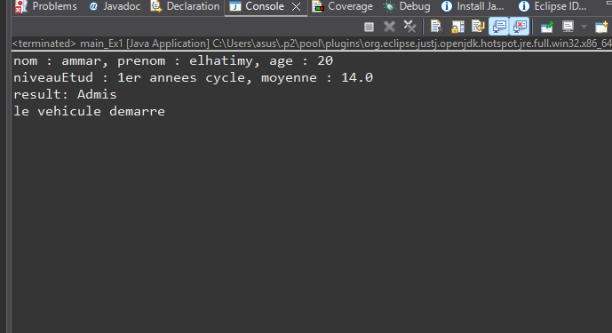
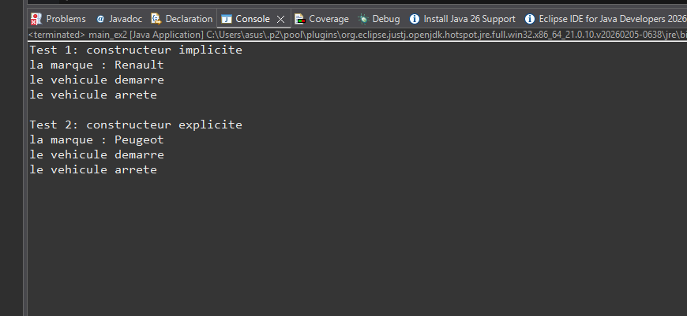
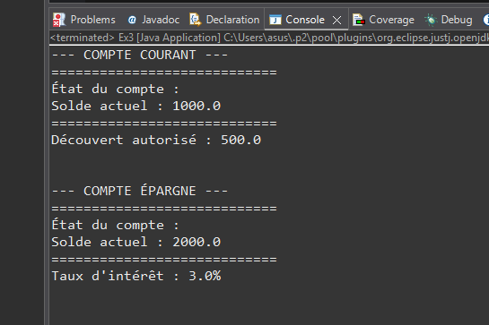
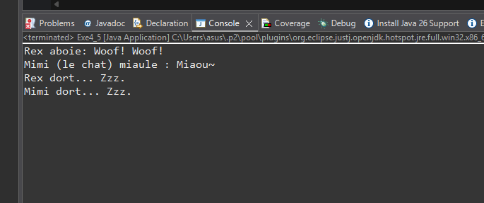
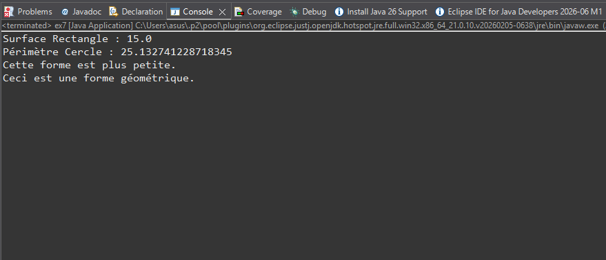
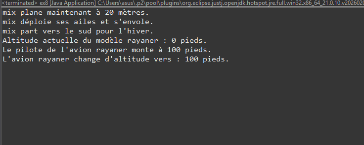
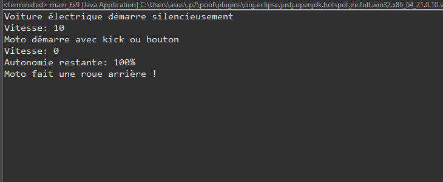
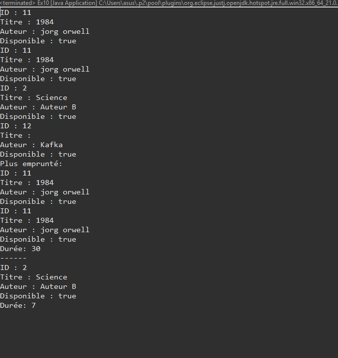

# Travaux Pratiques N°4 : Concepts Avancés de la POO en Java

## Description
Ce dépôt contient les solutions des exercices du TP4, portant sur les concepts d'Héritage, de Polymorphisme, de Classes Abstraites et d'Interfaces en Java.

## Liste des Exercices
Voici les captures d'écran des résultats (Outputs) pour chaque exercice du TP :

### 1. Initialisation et Spécialisation (Personne & Étudiant)

### 2. Gestion de Véhicules (Constructeurs super)

### 3. Système Bancaire (Héritage & Redéfinition)

### 4. Polymorphisme Dynamique (Cris d'Animaux)

### 5. Figures Géométriques (Polymorphisme)

### 6. Volant (Interface)

### 7. Un Système de véhicules modernes

### 8. Cas d'étude : Bibliothèque Numérique

---

## Structure du Projet
- **/src** : Contient les fichiers sources Java (.java).
- **/screenshots** : Contient les 8 captures d'écran de l'exécution du code.
